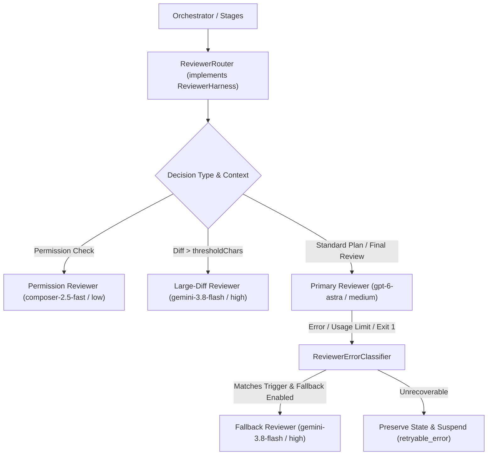

# Technical Specification — Stage 06: Reviewer Routing and Resilience

## Architectural Design

The reviewer subsystem transitions from a single hard-coded reviewer adapter to a routed multi-model architecture. The orchestrator engine depends solely on the generic `ReviewerHarness` interface, and `ReviewerRouter` implements that interface while dispatching internally across specialized model adapters.



## Domain Contracts

In `src/harness/types.ts`:

```ts
export type ReviewerRole = 'primary' | 'fallback' | 'large_diff' | 'permission';

export type ReviewerFallbackTrigger =
  | 'usage_limit'
  | 'rate_limit'
  | 'quota_exhausted'
  | 'no_result'
  | 'process_crash'
  | 'timeout'
  | 'turn_failed';

export interface ReviewerModelConfig {
  harness: string;
  model: string;
  thinking?: 'low' | 'medium' | 'high';
  reasoningEffort?: 'low' | 'medium' | 'high';
  verbosity?: 'low' | 'medium' | 'high';
  timeoutMinutes?: number;
  timeoutSeconds?: number;
  contextMode?: 'evidence_only' | 'project_readonly';
}

export interface ReviewerRouterConfig {
  primary: ReviewerModelConfig;
  fallback: ReviewerModelConfig & {
    enabled: boolean;
    triggers: ReviewerFallbackTrigger[];
  };
  largeDiff: ReviewerModelConfig & {
    thresholdChars: number;
  };
  permission: ReviewerModelConfig;
}

export interface ReviewerFallbackMetadata {
  executed_by: string;
  fallback_from: string;
  trigger: ReviewerFallbackTrigger;
  original_error: string;
  timestamp: string;
}
```

## Module Decomposition

Suggested file layout under `src/`:

```text
src/
├── harness/
│   ├── types.ts                     # Extended with ReviewerRouterConfig & ReviewerRole
│   ├── registry.ts                  # Register CursorReviewerHarness
│   ├── ReviewerErrorClassifier.ts   # Classifies errors and wire events into triggers
│   ├── codex/
│   │   └── CodexReviewerHarness.ts  # Isolated Codex reviewer adapter
│   └── cursor/
│       ├── CursorExecutorHarness.ts # Existing executor adapter
│       └── CursorReviewerHarness.ts # New schema-constrained reviewer adapter
├── orchestrator/
│   └── services/
│       ├── ReviewerRouter.ts        # Dynamic dispatching & fallback orchestration
│       └── ReviewPayloadBuilder.ts  # Diff analysis, diff-stat, and context bounding
└── config/
    └── schemas.ts                   # Validation schemas for reviewer router config
```

## Component Responsibilities

### 1. `ReviewerErrorClassifier` (`src/harness/ReviewerErrorClassifier.ts`)

Extracts semantic triggers from process exit codes, stderr lines, and JSONL events:

```ts
export class ReviewerErrorClassifier {
  static classify(
    exitCode: number | null,
    stderr: string,
    eventLines: string[],
    resultFileExists: boolean,
  ): { isTrigger: boolean; trigger: ReviewerFallbackTrigger | null; reason: string } {
    // 1. Scan eventLines for type: "error" or "turn.failed"
    // 2. Check for OpenAI/Codex usage limit strings:
    //    /usage limit|rate limit|quota|429|credits|too many requests/i
    // 3. Check for process crashes without result.json
    // 4. Return normalized classification
  }
}
```

### 2. `CursorReviewerHarness` (`src/harness/cursor/CursorReviewerHarness.ts`)

Executes the Cursor CLI (`agent` binary) in read-only schema-validated review mode:

- Runs in an isolated temporary directory with read-only sandbox.
- Passes prompt via stdin or file with strict reviewer role boundaries:
  - Disallows file edits, command execution, and subagent spawning.
- Passes the schema file (`final-verdict.schema.json`, `plan-verdict.schema.json`, `permission-verdict.schema.json`) to enforce structured JSON output.
- Configures thinking level (`low`, `medium`, `high`) corresponding to configuration.
- Reads and parses the resulting output, validating against schema types before returning.

### 3. `ReviewerRouter` (`src/orchestrator/services/ReviewerRouter.ts`)

Implements `ReviewerHarness` and acts as the single point of entry for the orchestrator:

- **Permission Requests:** Dispatches to `permissionReviewer`. Enforces quick execution timeout (default 30s).
- **Implementation Reviews:**
  - Evaluates `input.diff.length`.
  - If `diff.length > largeDiff.thresholdChars`, selects `largeDiffReviewer`.
  - Otherwise, selects `primaryReviewer`.
- **Plan Reviews & Question Answering:** Dispatches to `primaryReviewer`.
- **Failover Wrapper:**
  ```ts
  private async executeWithFallback<T>(
    role: ReviewerRole,
    executeFn: (harness: ReviewerHarness) => Promise<T>,
    context: { kind: string; payload: any },
  ): Promise<T> {
    const primary = this.resolveHarness(role);
    try {
      return await executeFn(primary);
    } catch (err: any) {
      if (!this.config.fallback.enabled || role === 'fallback') {
        throw err;
      }
      const classification = this.classifier.classifyError(err, primary);
      if (this.config.fallback.triggers.includes(classification.trigger)) {
        this.events.emit('reviewer.fallback', {
          failedRole: role,
          trigger: classification.trigger,
          reason: classification.reason,
          fallbackModel: this.config.fallback.model,
        });
        const fallback = this.resolveHarness('fallback');
        const res = await executeFn(fallback);
        this.annotateResult(res, primary.info, fallback.info, classification.trigger);
        return res;
      }
      throw err;
    }
  }
  ```

### 4. `ReviewPayloadBuilder` (`src/orchestrator/services/ReviewPayloadBuilder.ts`)

Constructs the review payload and prevents diff truncation blindness:

- Generates unified diff via `git.reviewDiff(paths)`.
- Calculates character count and token approximations.
- Injects `diff_stat` summary and `changed_files` list so file presence is visible even if body sections require pagination.
- If diff is under `maxDiffChars`, provides complete untruncated diff.
- If `requested_paths` were specified in prior `NEEDS_CONTEXT` verdict, prioritized paths are embedded in full before remaining diff lines.

## Offline Test Suite

Unit and integration tests must run 100% offline without live network or external AI subscriptions:

1. **`ReviewerErrorClassifier.test.ts`:**
   - Feeds sanitized JSONL snippet from run `20260915T193118Z-76e14b` containing `You've hit your usage limit. Upgrade to Pro...`.
   - Asserts classification as `usage_limit`.
   - Tests rate limit 429 string, empty result file with non-zero exit, and clean exit 0.
2. **`ReviewerRouter.test.ts`:**
   - Mock primary reviewer rejecting with usage limit error.
   - Asserts fallback reviewer is invoked and returns `APPROVE`.
   - Asserts `reviewer.fallback` event is emitted.
   - Asserts resulting JSON contains `_orchestrator_meta` fallback provenance.
   - Tests threshold routing: diff of 350,000 chars routes to mock `largeDiff` reviewer.
   - Tests permission routing: permission request invokes mock `permissionReviewer`.
3. **`CursorReviewerHarness.test.ts`:**
   - Tests schema generation, prompt formatting, role-boundary enforcement, and result parsing with mocked child process.

## Definition of Done

Run and pass:

```bash
npm run format:check
npm run lint
npm run typecheck
npm test
npm run test:cli
npm run verify
```
