# AI Universal Coding Harness

## Project Context, Functional Specification, Architecture and Operating Model

**Project:** `blackandcode/ai-universal-coding-harness`  
**Document purpose:** Canonical reusable context for future design, implementation, review, debugging, and planning conversations.  
**Status:** Consolidated project specification based on the current conversation/project history, the current public GitHub repository, current repository documentation, and the latest quality-gate incident analysis.  
**Date:** 2026-09-15

---

# 1. Executive Summary

AI Universal Coding Harness is a cross-platform command-line orchestrator for autonomous, staged software delivery. It does not try to be a coding model itself. Instead, it coordinates specialized AI coding harnesses through a deterministic workflow that separates implementation from judgment and separates both from Git/state orchestration.

The primary workflow is:

> **Stage specifications → planning → implementation → deterministic quality verification → independent review → exactly one stage commit**

The project exists to make long-running AI coding work safer, repeatable, auditable, resumable, and largely autonomous while preserving human control over the final merge/push lifecycle.

The core architectural separation is:

- **Orchestrator:** owns lifecycle, state transitions, run persistence, Git branch/commit lifecycle, frozen inputs, and coordination.
- **Executor harness:** reads the target repository, plans, writes code, runs tests/quality commands, requests permissions, asks blocking questions, and produces execution evidence.
- **Reviewer harness:** reviews plans and implementations, answers executor questions where appropriate, makes permission decisions when deterministic policy cannot, and returns decisions such as APPROVE/REWORK. It does not mutate the project or own Git lifecycle.
- **Mechanical verifier:** corroborates evidence independently before reviewer approval is trusted as a path to commit.
- **Human:** chooses stages, configures policy, inspects results, and ultimately decides whether to merge/push the AI branch.

The current public repository baseline is version **2.1.7**, requires **Node.js 24.18+**, and currently declares **TypeScript 7.0.2**, **React 19.2.8**, Ink 7.1.1, and Node's built-in test runner. The default executor/reviewer pairing is currently **Cursor** as executor and **Codex** as reviewer, while the adapter system is designed to remain harness-neutral.

---

# 2. Product Vision

The harness should allow a developer to hand a structured implementation plan to AI agents and receive a sequence of independently reviewed, quality-verified Git commits without manually supervising every tool invocation.

The desired product experience is:

1. A developer prepares one or more implementation stages.
2. The harness validates those stages before changing Git state.
3. The harness performs environment/harness preflight.
4. It creates a dedicated AI branch for the run.
5. For each explicitly selected stage:
   - the executor produces a plan;
   - the reviewer reviews the plan;
   - the executor implements the approved plan;
   - the executor runs required tests and quality commands;
   - the harness mechanically verifies the resulting evidence;
   - the reviewer independently reviews the implementation;
   - REWORK returns control to implementation;
   - APPROVE creates exactly one stage-named Git commit.
6. Run history and evidence remain available for inspection/resume.
7. The harness does **not** automatically push or merge.

The system should work across arbitrary repositories and technology stacks. Project-specific instructions, skills, MCP tools, tests, and coding conventions belong to the **target repository**, not to the global harness package.

---

# 3. Goals

The harness SHALL provide:

1. **Staged autonomous delivery** rather than one monolithic AI task.
2. **Independent review** separated from implementation.
3. **Mechanical quality corroboration** rather than trusting agent prose.
4. **Deterministic Git lifecycle** controlled by the orchestrator.
5. **One commit per approved stage** to produce clean, reviewable history.
6. **Resumable execution** after process termination, harness interruption, or machine restart where state permits.
7. **Frozen stage inputs** so the work performed can be traced to exact specifications.
8. **Patch fingerprinting** so plans/evidence are reused only when still valid for the current patch.
9. **Autonomous but controlled permissions** with explicit safety rules.
10. **Harness-neutral architecture** so executor/reviewer products can be replaced or extended.
11. **Cross-platform operation** on Linux, macOS, Windows, and WSL.
12. **Human-readable and machine-readable run history**.
13. **Stable terminal UI plus raw audit logs**.
14. **Target-repository awareness**, including project rules, skills, MCP configuration, files, and tests.
15. **Strong unit and integration testing** for state transitions, permissions, evidence, adapter behavior, and CLI behavior.

---

# 4. Non-Goals

The harness SHOULD NOT:

- become a general-purpose source-control replacement;
- automatically merge AI work into the user's primary branch;
- automatically push by default;
- let executor/reviewer agents independently create arbitrary commits or rewrite Git history;
- bypass permission policy in order to make a stage succeed;
- trust `evidence.json` or reviewer prose without corroboration;
- embed project-specific WordPress/PHP/Node/etc. development policy into the global harness package;
- assume Cursor/Codex are permanent requirements;
- require the orchestrator to execute arbitrary project build commands merely to compensate for missing executor telemetry;
- silently continue after invalid stage specifications, unsafe ZIP contents, ambiguous stages, corrupted state, or invalid evidence.

---

# 5. Actors and Responsibilities

| Actor                 | Responsibilities                                                                                              | Explicitly does not own                                 |
| --------------------- | ------------------------------------------------------------------------------------------------------------- | ------------------------------------------------------- |
| Human / CI caller     | Select stages, configure run, inspect status/results, final merge/push                                        | Per-command implementation work                         |
| CLI                   | Command parsing, repository discovery, config resolution, user-facing control surface                         | Project implementation                                  |
| Orchestrator          | Stage state machine, lifecycle, run persistence, coordination, Git branch/commit lifecycle                    | Arbitrary implementation/quality execution              |
| Executor Harness      | Plan, inspect repo, edit files, run tests/quality, request permissions, ask blocking questions, emit evidence | Final approval, run Git lifecycle                       |
| Reviewer Harness      | Review plan and implementation, answer questions, decide uncertain permissions                                | Editing target repository, committing, pushing, merging |
| Permission Engine     | Deterministic safe/unsafe classification and policy enforcement                                               | Implementation decisions                                |
| Evidence Verifier     | Corroborate claimed quality/test evidence against observed execution and mechanical checks                    | Semantic code review                                    |
| Git Repository module | Branch/repository operations and Git-specific mechanical checks                                               | Application implementation                              |
| State subsystem       | Durable run/stage state, locks, hashes/fingerprints, resume metadata                                          | Review decisions                                        |
| UI / Event system     | Semantic terminal output and observability                                                                    | Business logic                                          |

---

# 6. System Context

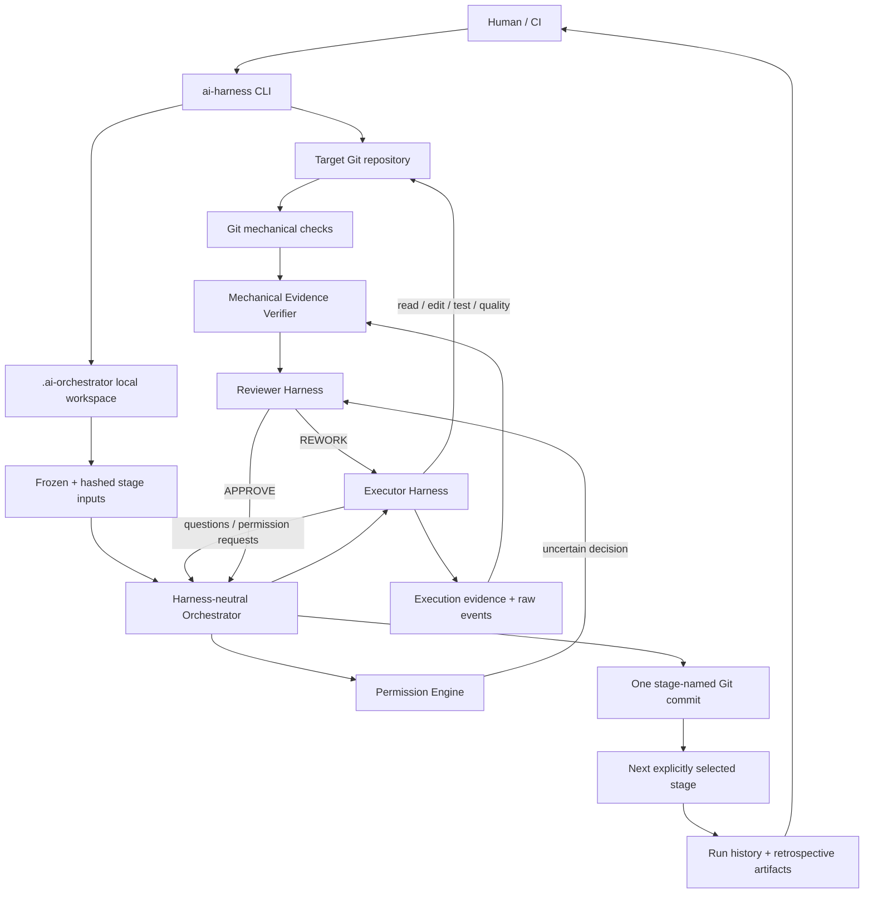

---

# 7. Repository and Runtime Model

## 7.1 Global package

The package is installed globally and exposes at least these binaries:

- `ai-harness`
- `ai-universal-coding-harness`

The package contains generic orchestration logic, schemas, default permissions, documentation, and harness adapters.

## 7.2 Target repository

The harness always resolves a target Git repository before running stage orchestration. Executor subprocesses that require project context run with the target repository as their working directory.

This is important because the target repository may contain:

- `AGENTS.md`
- `.agents/skills/`
- `.cursor/rules/`
- `.cursor/skills/`
- MCP/tool configuration
- project-specific documentation
- tests and quality scripts
- framework/language rules

The global harness must not copy its own development rules into target projects.

## 7.3 Local orchestration workspace

`ai-harness init` creates a Git-excluded local workspace:

```text
.ai-orchestrator/
├── config.jsonc
├── permissions.jsonc
├── latest-run
├── orchestrator.lock
├── runs/
├── stage-input/
└── stage-runtime/
```

Responsibilities:

- `config.jsonc`: local project/user overrides.
- `permissions.jsonc`: local permission policy overrides.
- `stage-input/`: frozen validated stage packages used by the run.
- `stage-runtime/`: current runtime artifacts/evidence for stages.
- `runs/<run-id>/`: durable per-run state, logs, retrospective artifacts, evidence, and phase state.
- `orchestrator.lock`: prevents unsafe concurrent orchestration in the same repository.
- `latest-run`: convenience pointer to the most recent run.

---

# 8. Stage Contract

A stage is the atomic unit of autonomous delivery.

Required directory shape:

```text
stage-NN-kebab-name/
├── functional-spec.md
├── technical-spec.md
└── prompt.md
```

## 8.1 Functional specification

Defines **what** must be achieved:

- user/business behavior;
- scope;
- acceptance criteria;
- constraints;
- edge cases;
- user-visible outcomes;
- explicit non-goals where needed.

## 8.2 Technical specification

Defines **how** the target repository should implement it:

- architecture;
- files/components likely affected;
- data/interface changes;
- compatibility constraints;
- migration requirements;
- testing strategy;
- security/performance concerns.

## 8.3 Prompt

Defines execution instructions for the coding agent:

- implementation priorities;
- repository-specific reminders;
- required validation commands;
- output/evidence expectations;
- constraints that must remain visible during implementation.

## 8.4 Validation requirements

Before any implementation branch is created, every explicitly selected stage must pass structural validation:

1. directory matches `stage-NN-kebab-case-name`;
2. directory is real, not a symlink;
3. all three required Markdown files exist;
4. required files are regular files, not symlinks;
5. required files contain non-empty text;
6. each required file contains at least one Markdown heading;
7. numeric selectors resolve to exactly one stage;
8. unsafe ZIP traversal entries are rejected before extraction.

The same validation logic should be reused by `validate`, `inspect`, `preflight`, and `run` so validation behavior cannot drift between commands.

---

# 9. CLI Functional Requirements

The CLI is the main product surface.

## 9.1 Initialization

```bash
ai-harness init
```

SHALL:

- verify execution is associated with a usable Git repository;
- create the local `.ai-orchestrator/` workspace if absent;
- create local config/permission templates as applicable;
- avoid destructive overwrite of existing valid user configuration;
- keep runtime workspace out of normal tracked project changes.

## 9.2 Validation

```bash
ai-harness validate --stage-source <source> [--stage <selector> ...]
```

SHALL validate stage packages without running agents or modifying Git branch state.

Stage sources may include directories and supported ZIP packages.

## 9.3 Inspection

`inspect` SHALL allow the user to resolve and inspect what stages/configuration will be used without starting execution.

## 9.4 Preflight

```bash
ai-harness preflight --stage-source <source> --stage <selector>
```

SHALL validate:

- stage source;
- selected stage resolution;
- target repository prerequisites;
- executor harness availability;
- reviewer harness availability;
- configured binaries/models/context policies where checkable;
- other fail-fast runtime requirements.

Preflight should fail before creating an AI implementation branch whenever possible.

## 9.5 Run

```bash
ai-harness run \
  --stage-source docs/specifications/my-feature \
  --stage 06 \
  --stage 07
```

SHALL:

- validate every selected stage first;
- freeze and hash stage input;
- perform preflight;
- create a dedicated AI branch only after validation/preflight succeeds;
- execute only explicitly selected stages;
- process stages in deterministic order;
- create one commit after each approved stage;
- stop safely on unrecoverable failure;
- persist enough state to support diagnosis/resume.

## 9.6 Status

```bash
ai-harness status
```

SHALL display current/latest run state, current stage, phase, attempts, blocking condition, and other concise progress information.

## 9.7 Tail

```bash
ai-harness tail
```

SHALL expose live or recent semantic/raw run activity useful for diagnosis without corrupting the main terminal UI.

## 9.8 Resume

```bash
ai-harness resume [--run <run-id>]
```

SHALL reconstruct the safest valid continuation point from durable state.

Resume behavior must obey hashes and fingerprints:

- approved plan can be reused only when relevant plan/spec hashes still match;
- evidence can be reused only when its patch fingerprint matches current work;
- executor session identifiers should be reused when supported by the adapter;
- persisted raw executor events may be replayed to rebuild derived observations where safe.

## 9.9 Run history reset

```bash
ai-harness runs reset --force
```

SHALL remove run history, frozen inputs, and runtime evidence while preserving local configuration and permissions.

---

# 10. Configuration Model

Effective configuration follows a deterministic precedence hierarchy:

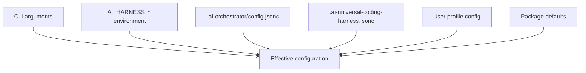

Higher layers override lower layers.

Configuration responsibilities include:

- executor harness;
- reviewer harness;
- harness-specific model/binary/timeouts;
- reviewer context mode;
- permission mode;
- quality command(s);
- stage/run behavior;
- external harness modules;
- UI/runtime options.

Harness-specific settings must remain under adapter-specific namespaces rather than polluting generic engine configuration.

---

# 11. Harness Adapter Architecture

The orchestration engine depends on interfaces, not concrete products.

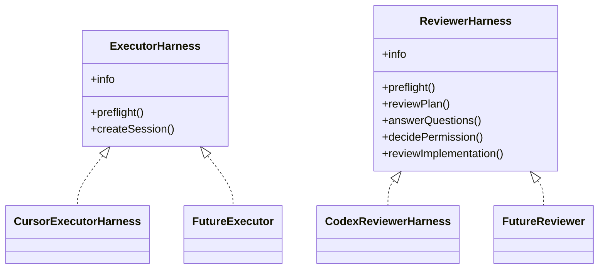

## 11.1 Executor responsibilities

The executor SHALL be able to:

- inspect target-repository context;
- prepare an implementation plan;
- implement repository changes;
- run project tests and quality commands;
- request permission for operations it cannot autonomously execute;
- ask genuinely blocking questions;
- produce structured execution evidence;
- expose/stream useful execution events;
- support session resume where the underlying product allows it.

## 11.2 Reviewer responsibilities

The reviewer SHALL:

- critique/approve/rework executor plans;
- answer executor questions when answerable from specs/project evidence;
- decide uncertain permission requests according to policy;
- review implementation after quality evidence is corroborated;
- return structured decisions.

The reviewer SHALL NOT:

- edit target files;
- own branch creation;
- commit;
- push;
- merge;
- rewrite Git history.

## 11.3 External adapters

The project SHALL allow additional adapters to be loaded through configuration, for example:

```json
{
  "harnessModules": ["@my-org/ai-harness-claude"],
  "executorHarness": "claude"
}
```

An external module registers executor/reviewer factories with the harness registry. Package modules resolve from the target project; relative paths resolve from the target repository root.

---

# 12. Planning Flow

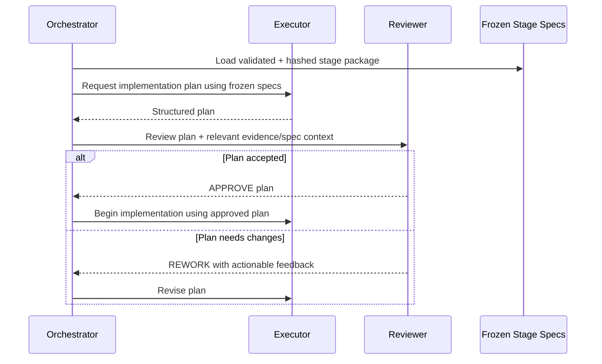

Functional requirements:

- plan review must occur before implementation when required by the configured workflow;
- plan feedback must be actionable and persisted;
- repeated planning must not silently lose the stage specification;
- approved plans may be reused on resume only if associated hashes still match.

---

# 13. Implementation and Quality Flow

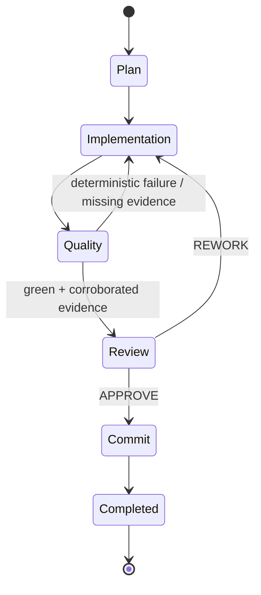

## 13.1 Implementation

The executor performs edits and necessary project commands in the target repository.

The orchestrator must remain orchestration-focused; it should not become a second implementation shell merely to compensate for adapter telemetry failures.

## 13.2 Quality

Quality is not equivalent to the executor saying “tests passed.”

The executor must generate evidence describing the commands/checks it ran. The harness then corroborates those claims against trustworthy observations and mechanical repository checks.

Only **green + corroborated evidence** may proceed to semantic review.

---

# 14. Evidence and Quality Corroboration

This is a critical project subsystem.

## 14.1 Principle

> **Agent claims are not ground truth. Observable execution plus deterministic checks are ground truth.**

The evidence subsystem SHALL distinguish:

- what the executor claims;
- what command/tool telemetry shows actually happened;
- what exit/result data shows;
- what Git/repository mechanical checks independently prove.

## 14.2 Evidence inputs

Evidence may include:

- structured `evidence.json` emitted for a stage;
- observed executor commands;
- exit codes/statuses;
- raw ACP/event logs;
- project quality command result;
- `git diff --check` or other repository hygiene check;
- patch fingerprint;
- changed-file summary;
- test counts/results where available.

## 14.3 Current ACP reliability requirement

A recent failure demonstrated that Cursor ACP tool events can arrive in multiple chunks. The initial chunk may contain `rawInput` while the completion chunk contains only `rawOutput`. Derived command detail must therefore be **accumulated**, not recomputed destructively per chunk.

The adapter SHALL preserve prior tool state when later chunks omit fields.

Expected logic includes:

- merge `rawInput` from current or previous chunk;
- merge `rawOutput` from current or previous chunk;
- preserve previously discovered command detail;
- preserve/update exit code when completion information arrives later;
- update an already-observed tool entry instead of discarding late status information;
- capture commands executed through external permission execution paths;
- replay persisted ACP events on resume when necessary to reconstruct observations.

## 14.4 Command matching

Evidence verification SHOULD tolerate semantically equivalent command wrappers while avoiding dangerous overmatching.

Examples:

- `npm run check`
- `sh -c "npm run check"`
- `npm run check && git diff --check`
- `git diff --check --cached`
- `git diff --check HEAD`

The verifier should normalize harmless quoting/whitespace and recognize compound commands where each expected command is actually present.

## 14.5 Git-owned verification

Git-specific mechanical truth belongs in the Git module. For example, `GitRepository.diffCheck()` is the appropriate authority for whitespace/error validation.

This is distinct from arbitrary project quality execution. The orchestrator may consult a Git abstraction because Git lifecycle is already an orchestrator-owned responsibility.

## 14.6 Prohibited fallback pattern

The orchestrator SHOULD NOT automatically execute `quality_cmd` itself every time evidence corroboration fails.

Reasons:

- violates executor/orchestrator separation;
- bypasses normal executor permission semantics;
- may use a different environment from the executor;
- masks adapter telemetry defects;
- undermines the purpose of corroborating whether the executor actually performed the claimed work.

## 14.7 Evidence flow

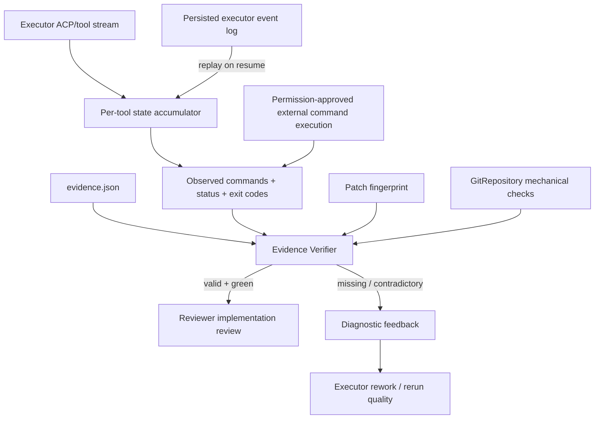

## 14.8 Diagnostics

When corroboration fails, the system SHOULD show useful diagnostic evidence, such as the last observed commands and their statuses/exit codes, rather than a generic “quality failed.”

This is essential for debugging both the project under test and the harness itself.

---

# 15. Permission and Autonomy Model

Permission decisions are **operation-scoped**. There is no arbitrary quota that should terminate a stage just because many legitimate permission decisions occurred.

Supported conceptual modes:

- `auto_safe`: deterministically safe operations auto-allow; uncertain operations go to reviewer. Recommended default.
- `allow_all`: auto-allow except hard-dangerous operations.
- `allowlist`: configured command prefixes auto-allow; other operations go to reviewer.
- `ask_reviewer`: all non-hard-dangerous operations go to reviewer.

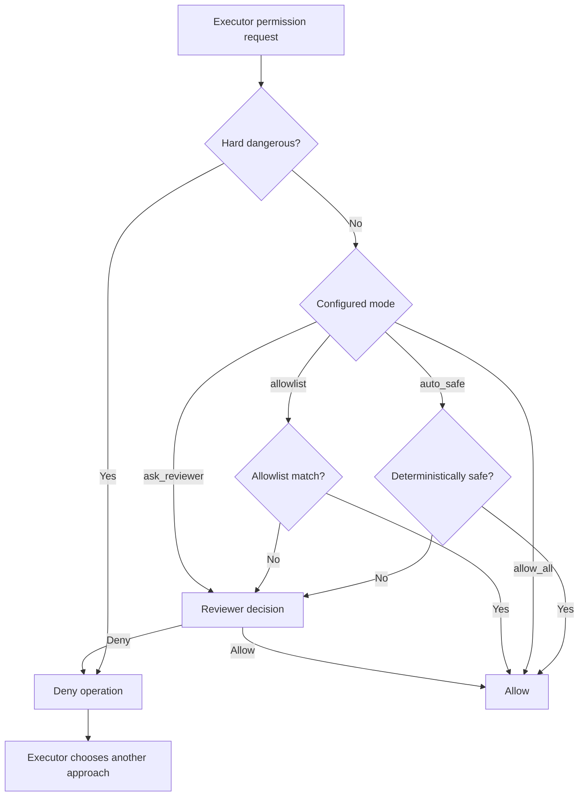

Hard-dangerous Git/system operations must remain denied because the orchestrator owns branch/commit lifecycle and because destructive host operations are outside normal autonomous work.

The default allowlist should remain deliberately narrow. Broad executors such as bare `git`, `npm`, `node`, `python`, `docker`, `curl`, or `gh` should not be blanket-approved unless every reachable subcommand is intentionally trusted.

---

# 16. Question Routing

The executor may encounter a blocking ambiguity.

Preferred behavior:

1. Executor attempts to resolve from frozen stage specs and repository context.
2. If unresolved, it emits a structured question.
3. Orchestrator routes the question according to configured workflow.
4. Reviewer answers questions that can be decided from available project/spec evidence.
5. Truly human-only business/product decisions should be surfaced to the human rather than fabricated.
6. Answer/decision is persisted and returned to the executor.

Questions must not allow the executor to bypass a denied permission by simply rephrasing the same unsafe action.

---

# 17. Git Lifecycle

Git lifecycle is an orchestrator-owned invariant.

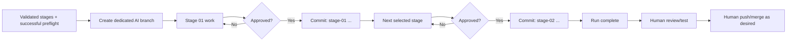

Requirements:

- no AI branch before stage validation succeeds;
- no stage commit before reviewer approval;
- exactly one stage-named commit per completed stage;
- executor/reviewer do not independently own commits;
- no automatic push or merge;
- hard-dangerous history rewrite operations remain prohibited from executor autonomy;
- resume must verify current repository state matches persisted run assumptions.

---

# 18. State, Persistence and Resume

The harness is designed for long-running work and therefore must assume processes can stop unexpectedly.

Durable state SHALL include enough information to determine:

- run ID;
- target repository identity/path;
- run branch;
- selected ordered stages;
- frozen stage input hashes;
- current stage;
- current phase;
- attempt number;
- approved plan and plan hash;
- executor/reviewer adapter/session identifiers where available;
- evidence file references;
- patch fingerprint;
- decisions/questions;
- commit outcome;
- completion/failure condition.

## 18.1 Reuse rules

- Approved plan reuse requires matching plan/spec hashes.
- Evidence reuse requires matching patch fingerprint.
- If the working tree changed independently, stale evidence must not be treated as current.
- Persisted raw executor events may be replayed to reconstruct derived telemetry.

## 18.2 Resume decision flow

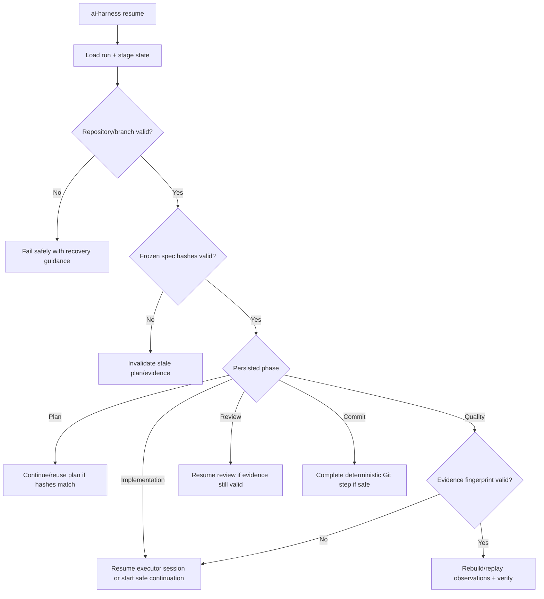

---

# 19. Terminal UI and Observability

The CLI should provide a stable, understandable terminal experience without hiding low-level evidence needed for debugging.

Two complementary outputs are required:

1. **Semantic UI/events** for humans:
   - run/stage/phase;
   - current agent action;
   - permission requests;
   - test/quality outcome;
   - reviewer decision;
   - commit completion;
   - actionable failure summaries.

2. **Raw audit logs** for diagnosis:
   - harness protocol traffic where permitted;
   - raw executor events;
   - command/status observations;
   - reviewer request/response;
   - state transitions;
   - evidence verification details.

The UI itself is currently implemented with Ink/React and must remain responsive across terminal sizes.

---

# 20. Technical Architecture / Package Boundaries

Current source-level conceptual modules:

```text
src/
├── core/          configuration, paths, filesystem, processes
├── git/           branch and repository lifecycle
├── harness/       pluggable executor/reviewer adapters
├── orchestrator/  stage state machine
├── permissions/   autonomous permission policy
├── project/       project init and local history lifecycle
├── quality/       execution evidence verification
├── stages/        source resolution, validation, plan coordination
├── state/         run persistence and repository lock
└── ui/            semantic events and Ink presentation
```

Boundary rules:

- `orchestrator/` coordinates; it should not absorb adapter parsing, arbitrary shell execution, or Git implementation details.
- `harness/` owns product-specific transport/protocol behavior.
- `quality/` owns corroboration logic independent of any specific executor implementation.
- `git/` owns Git mechanics and repository-specific deterministic validation.
- `state/` owns durable state mechanics rather than business phase decisions.
- `permissions/` owns permission policy rather than individual adapters inventing independent safety behavior.
- `ui/` consumes semantic events; core orchestration should remain usable independently of terminal rendering.

---

# 21. Technology Baseline

Current public repository baseline at the time of this document:

- Node.js: `>=24.18.0`
- TypeScript: `7.0.2`
- React: `19.2.8`
- Ink: `7.1.1`
- jsonc-parser: `3.3.1`
- adm-zip: `0.6.1`
- Node built-in test runner via project test script
- ESM package (`"type": "module"`)

Primary verification scripts:

```text
npm run clean
npm run build
npm run typecheck
npm run test:unit
npm test
npm run test:cli
npm run verify
```

`npm run verify` is expected to combine type checking, test/build verification, CLI smoke tests, and package validation.

---

# 22. Testing Specification

Testing is a first-class requirement, especially because the project coordinates destructive-capable tooling and long-lived state.

## 22.1 Test layers

### Unit tests

Cover deterministic business logic:

- config precedence;
- stage selector/source resolution;
- stage structural validation;
- ZIP safety/path traversal protection;
- permission classification/modes;
- command normalization and matching;
- evidence corroboration;
- Git wrapper behavior;
- state serialization/reuse rules;
- harness registry;
- plan consolidation/review logic;
- event normalization;
- ACP chunk accumulation;
- CLI argument parsing.

### Adapter contract tests

Every executor/reviewer adapter should satisfy a common behavioral contract.

Test:

- preflight success/failure;
- session creation;
- streamed multi-chunk tool calls;
- late status/exit code updates;
- permission request routing;
- question routing;
- session resume/replay;
- malformed provider output;
- timeout/cancellation.

### Integration tests

Use temporary Git repositories to validate:

- init;
- validate;
- branch creation timing;
- stage lifecycle;
- one-commit-per-stage behavior;
- REWORK loops;
- deterministic quality failure;
- resume after interruption;
- stale fingerprint rejection;
- lock behavior;
- history cleanup.

### CLI smoke tests

Verify packaged CLI can be executed in realistic environments and expected commands exit with correct status.

### Cross-platform CI

CI should continue to cover Linux, Windows, and macOS on supported Node releases.

## 22.2 Critical regression tests from the ACP incident

Required test scenarios include:

1. Four/multi-chunk tool lifecycle where command input is present only in an early chunk and output/exit status only in the final chunk.
2. Exit code variants such as `exit_code`, `exitCode`, `code`, provider status mappings.
3. Backtick-enclosed command title extraction.
4. Compound shell commands.
5. Shell wrappers (`sh -c`, `bash -c`).
6. Commands executed after an explicit permission decision.
7. Replaying an existing event file into a fresh/resumed adapter session.
8. Updating an existing observed-command record when completion status arrives late.
9. Diagnostic output when an expected command cannot be corroborated.
10. Evidence invalidation when patch fingerprint changes.

---

# 23. Security and Safety Requirements

The system can invoke powerful coding agents and therefore must apply defense in depth.

Requirements:

- normalize and validate stage paths;
- reject unsafe ZIP path traversal;
- reject symlink-based stage contract tricks;
- maintain repository lock during mutable orchestration;
- restrict hard-dangerous operations regardless of reviewer willingness;
- keep Git branch/commit ownership in orchestrator;
- avoid broad default command allowlists;
- persist permission decisions/events for auditability;
- avoid leaking secrets in logs where adapters expose environment/tool output;
- treat provider/agent textual output as untrusted input;
- validate structured reviewer/executor protocol responses;
- fail closed on ambiguous destructive requests;
- never convert a telemetry bug into silent permission bypass.

---

# 24. Important Functional Invariants

The following rules should be treated as architectural invariants and protected by tests:

1. **Selected stage specs are validated before an AI branch is created.**
2. **Frozen stage specs are the run's source of truth.**
3. **Executor performs implementation and project quality commands.**
4. **Reviewer makes decisions; it does not mutate the project.**
5. **Orchestrator owns Git lifecycle and state-machine transitions.**
6. **Quality must be mechanically corroborated before review.**
7. **Agent-written evidence alone is insufficient.**
8. **A stage cannot commit until reviewer APPROVE.**
9. **REWORK returns to implementation, preserving audit history.**
10. **Exactly one orchestrator-owned commit is produced for each approved stage.**
11. **No automatic push or merge.**
12. **Plan/evidence reuse requires valid hashes/fingerprint.**
13. **Permissions are operation-scoped and not limited by an arbitrary decision quota.**
14. **Hard-dangerous operations remain denied.**
15. **Adapters are replaceable; provider details must not leak into generic engine design.**
16. **A provider streaming protocol must be accumulated/replayed without losing semantic command evidence.**
17. **Errors must be diagnosable from persisted human-readable and raw artifacts.**

---

# 25. Functional Acceptance Criteria

The project can be considered functionally complete for a stable major release when all of the following are true:

- A fresh repository can run `ai-harness init` successfully.
- Valid directory or ZIP stage sources can be resolved securely.
- Invalid/ambiguous stage sources fail before branch creation.
- Multiple selected stages run in deterministic order.
- Executor and reviewer preflight failures are clear and non-destructive.
- A dedicated run branch is created only after validation/preflight.
- Plan review and REWORK loops work without losing stage context.
- Executor can implement and run quality commands under permission policy.
- Permission requests are deterministically handled or routed to reviewer.
- Blocking executor questions are routed and persisted.
- Evidence captures observed commands and outcomes across multi-chunk provider events.
- Quality evidence is independently corroborated.
- Failed quality returns to implementation rather than progressing to review.
- Reviewer receives adequate evidence/context and can APPROVE or REWORK.
- APPROVE produces one correctly named stage commit.
- REWORK never accidentally commits.
- Run can be interrupted and resumed without trusting stale plan/evidence.
- Patch changes invalidate stale evidence.
- Raw logs and semantic history allow post-mortem diagnosis.
- Executor/reviewer adapters can be extended without editing orchestrator core.
- Test suite passes on Linux, Windows, and macOS.
- npm package verification prevents shipping incomplete/broken package contents.

---

# 26. Current Known Reliability Issue / Required Fix Direction

A real Stage 07 run exposed an important quality-corroboration failure:

- Cursor ACP emitted the executed commands in persisted events.
- 139 command executions existed in the event stream.
- Quality commands had in fact been run successfully.
- The in-memory observation system lost command detail because later ACP chunks omitted `rawInput` and the adapter replaced rather than retained previous tool state.
- As a result, evidence corroboration incorrectly saw zero observed commands.

The correct long-term response is architectural, not a bypass:

1. fix multi-chunk state accumulation in `CursorExecutorHarness`;
2. record late exit status updates correctly;
3. record permission-mediated command execution;
4. replay persisted ACP events during resume/reconstruction;
5. make command matching resilient to wrappers/compound commands;
6. provide strong diagnostics from `EvidenceVerifier`;
7. keep Git-specific `diff --check` verification in `GitRepository`;
8. avoid turning the orchestrator into an unpermissioned fallback shell.

This incident is now part of the project's functional requirements because reliable evidence is fundamental to the product promise.

---

# 27. Recommended Future Development Structure

Future major work should be specified in at most five independently reviewable stages. Each stage should use the native stage contract and be able to be handed directly to the harness itself.

Suggested high-level roadmap:

```text
ai-universal-coding-harness-next/
├── stage-01-core-contracts-and-state/
│   ├── functional-spec.md
│   ├── technical-spec.md
│   └── prompt.md
├── stage-02-harness-protocol-and-permissions/
│   ├── functional-spec.md
│   ├── technical-spec.md
│   └── prompt.md
├── stage-03-quality-evidence-and-resume/
│   ├── functional-spec.md
│   ├── technical-spec.md
│   └── prompt.md
├── stage-04-cli-ui-and-cross-platform-hardening/
│   ├── functional-spec.md
│   ├── technical-spec.md
│   └── prompt.md
└── stage-05-test-release-and-migration-hardening/
    ├── functional-spec.md
    ├── technical-spec.md
    └── prompt.md
```

These are roadmap groupings, not a demand to replace the current code blindly. The project should evolve incrementally while protecting existing public CLI contracts or explicitly versioning breaking changes.

---

# 28. Important Project Flows at a Glance

## 28.1 End-to-end run

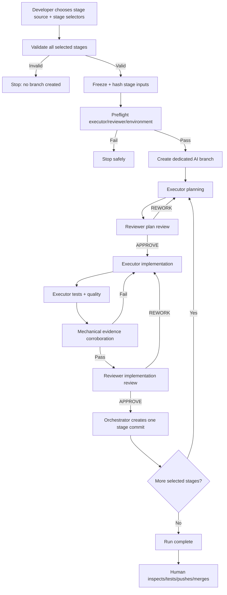

## 28.2 Separation of authority

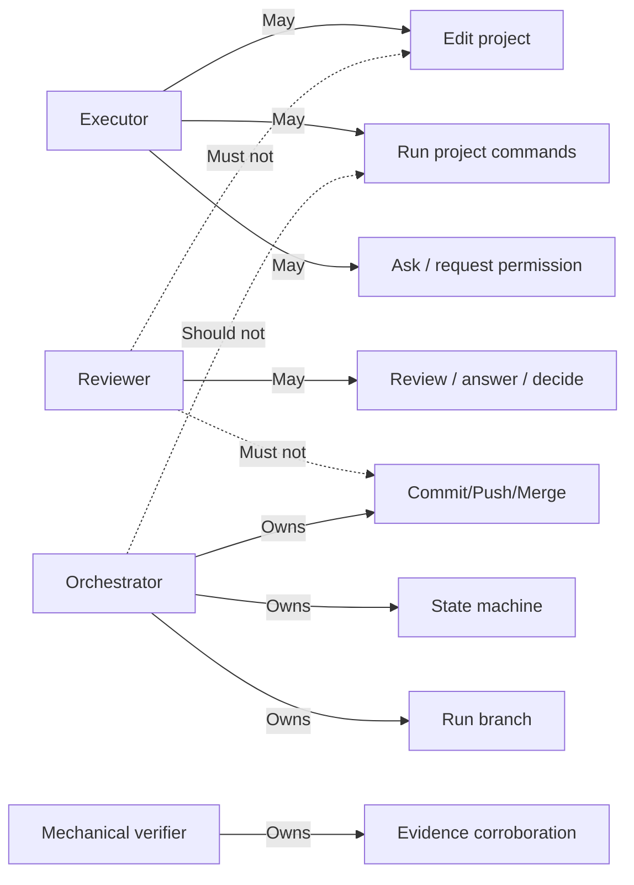

## 28.3 Evidence truth hierarchy

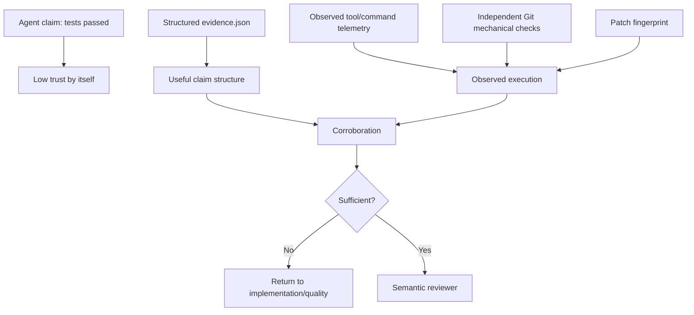

---

# 29. Sources Used for This Consolidation

## Project conversation/context

This document incorporates the design decisions and development history from the current Software AG project conversation context, especially the AI Universal Coding Harness threads around:

- initial orchestrator/executor concept;
- staged delivery model;
- modern Node/TypeScript/React baseline;
- rewrite planning;
- unit-test requirements;
- Cursor executor / Codex reviewer division;
- evidence corroboration failure and Stage 07 recovery analysis.

The private ChatGPT conversation URL supplied by the user is not itself a portable public source; the relevant conversation context available in this project was used instead.

## Current repository

- https://github.com/blackandcode/ai-universal-coding-harness
- repository README
- `docs/architecture.md`
- `docs/harnesses.md`
- `docs/permissions.md`
- `docs/state-and-resume.md`
- `docs/stage-contract.md`
- `docs/testing.md`
- `package.json`

## Uploaded project material

Recent quality-gate investigation notes documenting the Cursor ACP observation loss, evidence verifier requirements, Git diff-check ownership, resume behavior, and unit-test requirements were also incorporated.

---

# 30. Canonical Short Context for Future Messages

If only a compact context can be carried into a future conversation, use this:

> **AI Universal Coding Harness** is a Node/TypeScript cross-platform CLI that orchestrates staged autonomous coding across pluggable AI harnesses. The target flow is `validated stage specs → plan → implementation → executor quality commands → mechanically corroborated evidence → independent reviewer → one orchestrator-owned Git commit per approved stage`. The executor may edit/run project commands; the reviewer only makes decisions; the orchestrator owns run state and Git lifecycle; the mechanical verifier independently checks evidence. Stages contain `functional-spec.md`, `technical-spec.md`, and `prompt.md`; all selected stages are validated and frozen before branch creation. Runtime state lives in `.ai-orchestrator/`, with hashes/fingerprints controlling safe plan/evidence reuse and resume. Permissions are operation-scoped with `auto_safe` as the preferred mode; hard-dangerous operations remain denied. The architecture is harness-neutral, currently using Cursor as executor and Codex as reviewer, with external adapters supported. Current baseline is v1.0.3, Node >=24.18, TypeScript 7.0.2, React 19.2.8. A recent critical bug showed Cursor ACP multi-chunk events can lose command details if tool state is overwritten; the required fix is to accumulate/replay ACP state and improve EvidenceVerifier diagnostics, not to make the orchestrator run arbitrary project quality commands as a fallback. Strong unit/integration/cross-platform tests are mandatory.

---

# 31. Repository Snapshot Note

An attempt was made to clone the GitHub repository directly into the execution container, but that container currently cannot resolve `github.com`. The repository was therefore inspected through the live GitHub web source instead. This document reflects the current public repository contents observed on 2026-09-15, but it should not be interpreted as proof that a complete local Git clone exists in this runtime.
