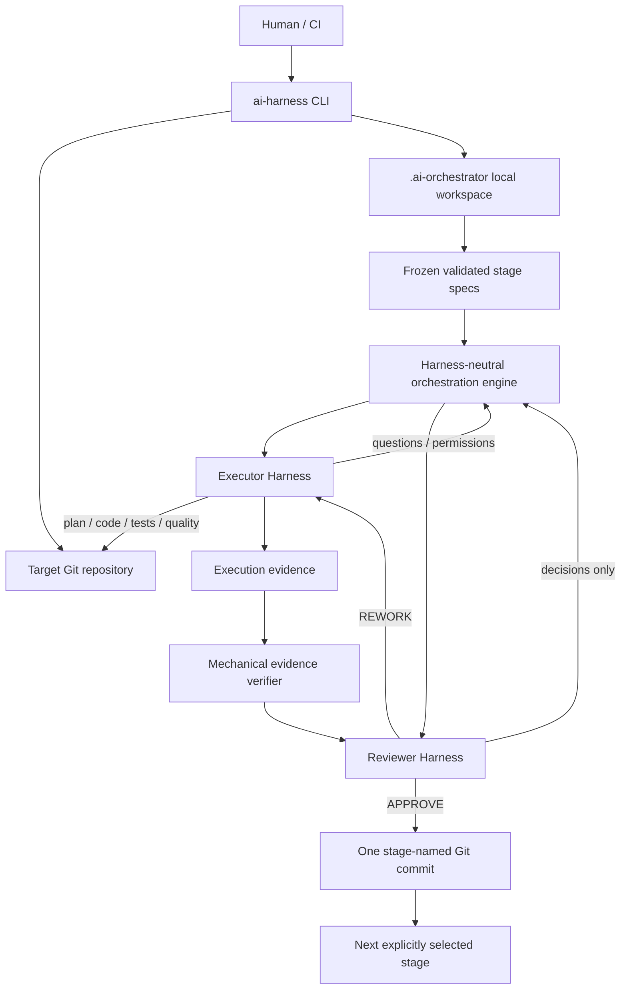
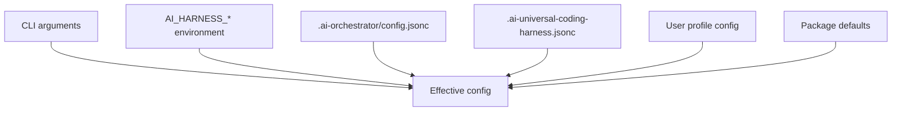

# Architecture

## System overview



## Repository-local lifecycle

```mermaid
flowchart LR
  Install[Install global npm CLI] --> Init[ai-harness init]
  Init --> Local[.ai-orchestrator]
  Local --> Validate[Validate selected stage packages]
  Validate --> Preflight[Harness preflight]
  Preflight --> Branch[Create dedicated AI branch]
  Branch --> Stages[Execute selected stages]
  Stages --> History[Human + machine run history]
  History --> HumanMerge[Human reviews/tests/merges]
```



No AI branch is created until selected stage packages have passed structural validation.

## Package modules

```text
src/
├── cli/           pure CLI argument parsing and dispatching
├── config/        configuration layers, paths, schema, normalization
├── core/          paths, filesystem, process execution, time
├── git/           branch and repository lifecycle
├── harness/       pluggable executor/reviewer adapters
├── orchestrator/  stage state machine and recovery
├── permissions/   autonomous permission classification and policy
├── project/       project init and local history lifecycle
├── quality/       execution evidence verification
├── stages/        source resolution, validation and plan coordination
├── state/         run persistence and repository lock
├── tooling/       package invariants and build tooling
└── ui/            semantic events and Ink presentation
```

The orchestration engine depends on harness interfaces, not Cursor/Codex implementations. The default registry currently provides `cursor` and `codex`.

## Target project context

The CLI resolves the target Git repository before loading the orchestration engine. Harness subprocesses receive that repository as their working directory when their adapter context policy requires project access.

That allows agent CLIs to discover repository-local instructions and capabilities naturally:

```text
AGENTS.md
.agents/skills/
.cursor/rules/
.cursor/skills/
MCP/tool configuration
repository files and tests
```

The global harness package does not copy its own development rules into target projects.

## Configuration layers



Higher layers override lower layers.
