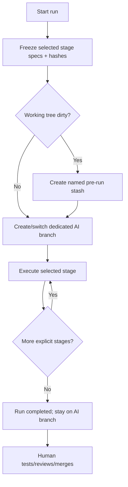
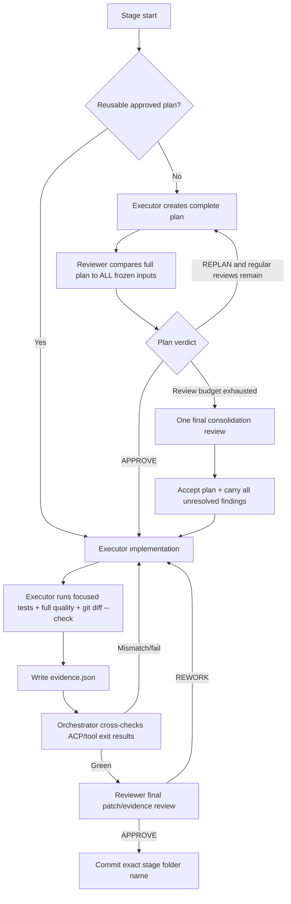

# Execution Flow

## Run lifecycle



The branch is created only when stage planning begins. No worktree is created.

## Stage lifecycle



## Plan-review rule

The reviewer gets up to `MAX_PLAN_REVIEWS` normal opportunities to identify **all** material gaps in one response.

After that, one final consolidation review is allowed. This pass is advisory and **cannot block execution**. Remaining findings become mandatory implementation carry-over.

If the executor submits the same unchanged plan repeatedly, the coordinator detects convergence and avoids repeatedly paying for the same review.

## Permission rule

Permission decisions have no stage-ending quota. A denied operation means only:

> that exact operation is not approved; choose another safe implementation path.

It never means “block the whole stage.”

## Quality evidence corroboration and recovery

The orchestrator mechanically cross-checks executor `evidence.json` against observed commands recorded by the executor harness session (including tool calls, command exits, and background broker executions).

If a stage run was interrupted or failed due to missing observations in an earlier session, the automated recovery command can reconstruct observations from historical logs and transition the stage safely:

```bash
# Preview what will be recovered (safe dry-run, no state modified)
ai-harness recover [--run <id>] [--stage <name>]

# Apply recovery, create timestamped backups, and write corroborated evidence
ai-harness recover [--run <id>] [--stage <name>] --apply

# Resume the run to proceed to reviewer evaluation and commit
ai-harness resume [--run <id>]
```
