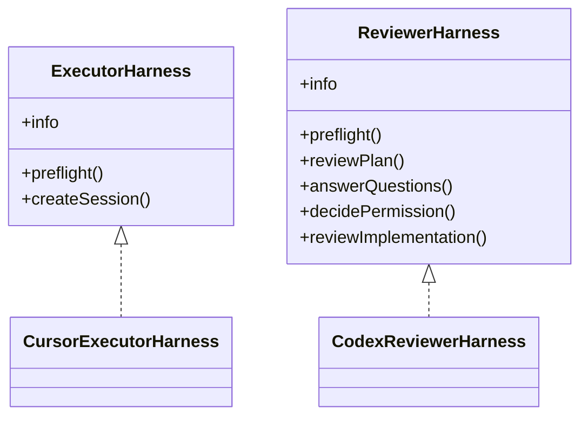

# Harnesses

Harnesses isolate product-specific agent behavior from the orchestration state machine.

## Roles

### Executor harness

Responsible for:

- planning
- reading/writing project files
- running tests and quality commands
- requesting permissions
- asking blocking questions
- producing execution evidence

### Reviewer harness

Responsible for:

- plan review
- answering executor questions
- permission decisions when deterministic policy cannot decide
- final implementation review

The reviewer does not own Git lifecycle and should not commit, push, merge, or mutate the target repository.

## Default adapters

```text
executor: cursor
reviewer: codex
```

Cursor is launched in the target project directory, allowing its native repository discovery to find project rules, skills, files, and MCP configuration. Cursor CLI automatically loads project `.cursor/rules`, `AGENTS.md`, project/user skills, and `.cursor/mcp.json` when those features are configured and enabled in Cursor. ACP mode supports project/user MCP configuration; team-dashboard MCP servers are outside ACP support.

Codex defaults to `evidence_only` review mode. Configure `harnesses.codex.contextMode` when repository-local Codex guidance is desired.

## Adding a harness

Implement the interfaces in `src/harness/types.ts`, then register factories in `HarnessRegistry`.



Harness-specific binaries, models, timeouts, and context policies belong inside the adapter configuration namespace, not the generic engine.

## External harness modules

Project config can load additional adapters without modifying the core package:

```jsonc
{
  "harnessModules": ["@my-org/ai-harness-claude"],
  "executorHarness": "claude"
}
```

A module exports `registerHarnesses(registry)` (or a default registration function) and calls `registerExecutor` / `registerReviewer`. Package names are resolved from the target project; relative module paths are resolved from the target repository root.

## Cursor context references

- Cursor CLI usage/rules/MCP discovery: https://prod.cursor.com/docs/cli/using
- Cursor ACP: https://prod.cursor.com/docs/cli/acp
- Cursor skills: https://prod.cursor.com/docs/skills
