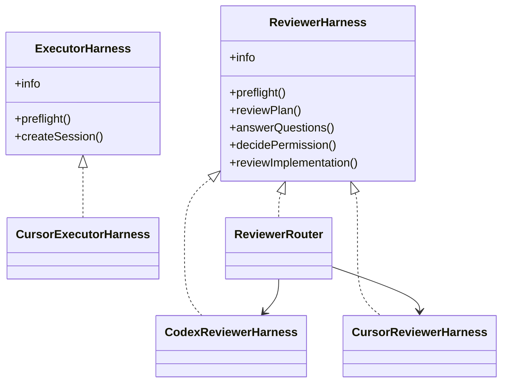

# Harnesses

Harnesses isolate product-specific agent behavior from the orchestration state machine.

## Roles

### Executor harness

Responsible for:

- planning
- reading/writing project files
- running tests and quality commands
- requesting permissions
- asking blocking questions
- producing execution evidence

### Reviewer harness

Responsible for:

- plan review
- answering executor questions
- permission decisions when deterministic policy cannot decide
- final implementation review

The reviewer does not own Git lifecycle and should not commit, push, merge, or mutate the target repository.

## Default adapters

```text
executor: cursor
reviewer: codex
```

Cursor is launched in the target project directory, allowing its native repository discovery to find project rules, skills, files, and MCP configuration. Cursor CLI automatically loads project `.cursor/rules`, `AGENTS.md`, project/user skills, and `.cursor/mcp.json` when those features are configured and enabled in Cursor. ACP mode supports project/user MCP configuration; team-dashboard MCP servers are outside ACP support.

Codex defaults to `evidence_only` review mode. Configure `harnesses.codex.contextMode` when repository-local Codex guidance is desired.

The default registry registers **cursor** as both executor and reviewer, and **codex** as reviewer. At runtime the orchestrator usually talks to a **ReviewerRouter** that picks the right adapter and model per task instead of a single hard-coded reviewer instance.

## ReviewerRouter (multi-tier routing)

`ReviewerRouter` implements `ReviewerHarness` and is the stage reviewer for standard Cursor + Codex setups. It reads `reviewer` from [Configuration](configuration.md) and dispatches by role:

| Role         | Used for                                                                             |
| ------------ | ------------------------------------------------------------------------------------ |
| `primary`    | Plan review, blocking questions, final review when diff ≤ `largeDiff.thresholdChars` |
| `large_diff` | Final implementation review when unified diff length exceeds `thresholdChars`        |
| `permission` | Permission decisions referred from the permission engine                             |
| `fallback`   | Invoked automatically when the active role fails with a configured trigger           |

On failure, `ReviewerErrorClassifier` maps stderr, exit codes, and wire events to triggers such as `usage_limit`, `rate_limit`, or `process_crash`. When `reviewer.fallback.enabled` is true and the trigger is listed in `reviewer.fallback.triggers`, the router retries with the fallback harness, emits a `reviewer.fallback` UI event, and may attach `_orchestrator_meta` on the verdict for audit.

`ai-harness preflight` checks primary, fallback (if enabled), large-diff, and permission adapters and prints composite diagnostics.

## Cursor reviewer adapter

`CursorReviewerHarness` runs the Cursor CLI (`agent`) as a read-only reviewer: sandboxed execution, plan-oriented mode, schema-guided prompts, and JSON verdict validation (`plan-verdict`, `final-verdict`, `permission-verdict`, `question-verdict` schemas). It does not commit or mutate the target repository. It is the default fallback and large-diff engine in package defaults.

## Codex reviewer adapter

`CodexReviewerHarness` remains the default **primary** reviewer for plan and standard final reviews, with subprocess metadata preserved for error classification when turns fail without `result.json`.

## Adding a harness

Implement the interfaces in `src/harness/types.ts`, then register factories in `HarnessRegistry`.



Harness-specific binaries, models, timeouts, and context policies belong inside the adapter configuration namespace, not the generic engine.

## External harness modules

Project config can load additional adapters without modifying the core package:

```jsonc
{
  "harnessModules": ["@my-org/ai-harness-claude"],
  "executorHarness": "claude"
}
```

A module exports `registerHarnesses(registry)` (or a default registration function) and calls `registerExecutor` / `registerReviewer`. Package names are resolved from the target project; relative module paths are resolved from the target repository root.

## Cursor context references

- Cursor CLI usage/rules/MCP discovery: https://prod.cursor.com/docs/cli/using
- Cursor ACP: https://prod.cursor.com/docs/cli/acp
- Cursor skills: https://prod.cursor.com/docs/skills
