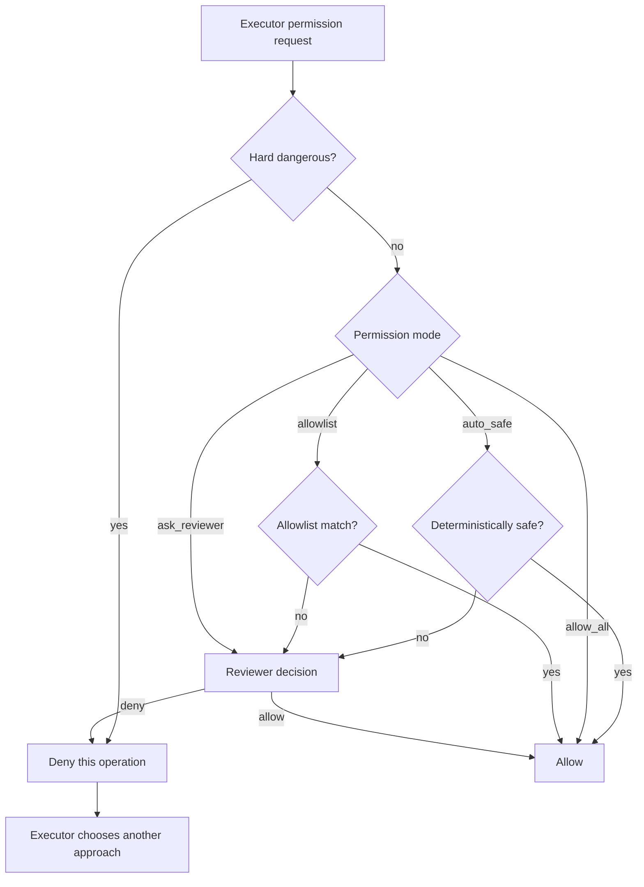

# Permissions and Autonomy

Permission decisions are operation-scoped. There is no permission-review quota that can terminate a stage merely because many decisions were needed.

## Modes

```text
auto_safe      deterministic safe operations auto-allow; uncertain operations go to reviewer
allow_all      everything except hard-dangerous operations auto-allows
allowlist      configured command prefixes auto-allow; otherwise reviewer
ask_reviewer   all non-hard-dangerous operations go to reviewer
```

`auto_safe` is the recommended default.

## Decision flow



Hard-dangerous Git history/system operations remain denied because the orchestrator owns branch and commit lifecycle.

When the flow reaches **Reviewer decision** (`V`), the orchestrator routes the request through `ReviewerRouter` using the `reviewer.permission` role: Cursor with `composer-2.5-fast`, low thinking, and a short timeout (default 30 seconds). That keeps permission turns fast and separate from plan or final code review on the primary Codex reviewer. Configure the role under `reviewer.permission` in [Configuration](configuration.md).

The shipped allowlist is deliberately narrow. Do not add broad executors such as bare `git`, `npm`, `node`, `python`, `docker`, `curl`, or `gh` unless every subcommand should be auto-approved.
