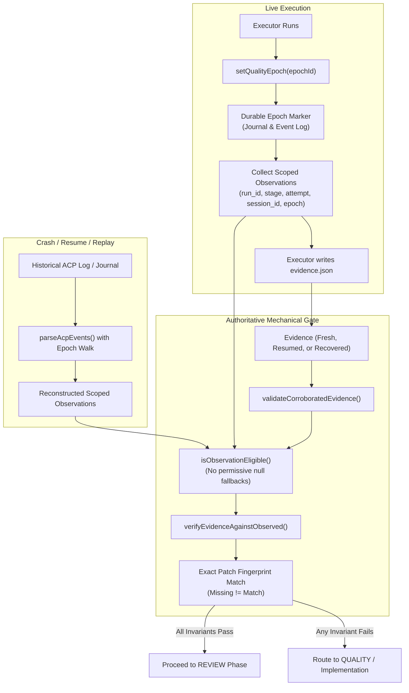

# Implementation Plan: Stage 02 — Evidence, State and Recovery Trust Hardening

## 1. Comparison: Current Repository State vs Stage 02 Requirements

A thorough analysis of the codebase against `docs/ai-universal-coding-harness-modernization-gap-closure/stage-02-evidence-state-and-recovery-trust-hardening/` reveals that while initial structural foundations exist, all four primary trust findings (**F-03, F-04, F-05, F-06**) remain unaddressed in the current codebase:

- **Finding F-03 (`quality_epoch_id` & scope identity)**:
  - _Current State_: `quality_epoch_id` exists in [src/types.ts](../src/types.ts) and [src/quality/EvidenceVerifier.ts](../src/quality/EvidenceVerifier.ts), but `verifyEvidenceAgainstObserved()` **completely ignores** it. Filtering logic in `EvidenceVerifier.ts` allows missing stage (`!c.stage`) and missing attempt (`c.attempt == null`), permitting unscoped observations to validate scoped claims. Context lacks `runId` and `sessionId`.
  - _Required_: Exact matching for `run_id`, `session_id`, `stage`, `attempt`, and `quality_epoch_id` via a centralized `isObservationEligible()` predicate. Unscoped observations must never prove scoped epochs.
- **Finding F-04 (Resumed evidence corroboration bypass & loose caching)**:
  - _Current State_: In [src/orchestrator/Orchestrator.ts](../src/orchestrator/Orchestrator.ts) (line 600), `if (!isResumed && !corroboration.ok)` explicitly skips corroboration rejection when `isResumed === true`, routing failed resumed evidence straight to review. In [src/quality/EvidenceService.ts](../src/quality/EvidenceService.ts), `checkReusableEvidence()` only does `JSON.parse` without validating PASS, exit code 0, empty unresolved items, or stage/attempt identity.
  - _Required_: Eliminate `!isResumed` bypass so fresh and resumed evidence obey the exact same mechanical proof standard. Deeply validate reusable evidence before reuse.
- **Finding F-05 (Recovery fingerprint permissiveness & epoch reconstruction)**:
  - _Current State_: In [src/orchestrator/RecoveryManager.ts](../src/orchestrator/RecoveryManager.ts) (line 234), `!evidence.patch_fingerprint || evidence.patch_fingerprint === currentPatchFingerprint` allows missing fingerprints to recover directly to `REVIEW`. Furthermore, `parseAcpEvents()` in [src/harness/cursor/CursorExecutorHarness.ts](../src/harness/cursor/CursorExecutorHarness.ts) does not record or parse quality epoch boundaries, making post-crash ACP replay unable to reconstruct the active epoch.
  - _Required_: Recovery to `REVIEW` must require an exact matching patch fingerprint; missing fingerprint must route to `QUALITY`. Persist durable epoch markers (`quality_epoch_started`) in observation journals and ACP logs, and reconstruct them during replay.
- **Finding F-06 (Shallow state validation & silent corrupt state reset)**:
  - _Current State_: In [src/state/RunStateStore.ts](../src/state/RunStateStore.ts), `validateRunState()` only checks 5 top-level fields and shallowly casts `s as unknown as RunState`, ignoring nested `stages`, manifests, and sha256 maps. In `loadStage()`, a corrupt JSON state file is silently swallowed and resets to `{ version: 1, phase: 'pending' }`.
  - _Required_: Deep recursive runtime validators for `RunState`, `SelectedStage`, `StageManifest`, `StageRuntimeState`, and `CommandObservation`. Missing stage file returns pending default, but existing corrupt file throws `RunStateError`.

### Clean Boundary Separation (No Overlap)

- **Stage 03 Boundary**: Excluded from this stage (critical module coverage gates in `scripts/run-tests.mjs`, `test:versioning` in `verify`, Node minimum runtime matrix in CI).
- **Stage 04 Boundary**: Excluded from this stage (`maxUniqueQuestionsPerStage` question budget, `reviewer.<role>` Codex precedence, configuration contract tests).

---

## 2. ADR Pre-Planning Evaluation

- **Classification**: `ADR_REQUIRED` (alters persisted observation journal format with `quality_epoch_started` markers, establishes binding invariants for recursive state validation, and unifies fresh/resume/recovery corroboration rules).
- **Action**: Author and accept [docs/adr/0002-evidence-state-and-recovery-trust-hardening.md](./adr/0002-evidence-state-and-recovery-trust-hardening.md) before writing implementation code.

---

## 3. Architecture & Verification Flow



---

## 4. Implementation Steps

### Step 1: Author Architecture Decision Record (ADR-0002)

- Create [docs/adr/0002-evidence-state-and-recovery-trust-hardening.md](./adr/0002-evidence-state-and-recovery-trust-hardening.md) using the Nygard template.
- Document context (findings F-03 to F-06), decision (unified proof standard, explicit epoch markers, strict schema validation, fail-safe recovery routing), and consequences.
- Update [docs/adr/README.md](./adr/README.md).

### Step 2: Types & Verification Context Hardening

- In [src/types.ts](../src/types.ts):
  - Update `VerificationContext` to support both camelCase and snake_case properties (`runId`/`run_id`, `sessionId`/`session_id`, `stage`, `attempt`, `qualityEpochId`/`quality_epoch_id`, `expectedPatchFingerprint`/`expected_patch_fingerprint`, `lastMutationSequence`/`last_mutation_sequence`, `orchestratorDiffCheckOk`/`orchestrator_diff_check_ok`, `workspace`).
  - Define `QualityEpochMarker` interface:
    ```ts
    export interface QualityEpochMarker {
      record_type: 'quality_epoch_started';
      run_id?: string;
      stage?: string;
      attempt?: number;
      session_id?: string;
      quality_epoch_id: string;
      sequence: number;
      timestamp: string;
    }
    ```
  - Update `CommandObservation` and `ExecutionEvidence` docblocks and strict typing where needed.

### Step 3: Deep State & Observation Runtime Validators

- In [src/state/RunStateStore.ts](../src/state/RunStateStore.ts):
  - Implement `validateStageManifest(data: unknown): StageManifest`.
  - Implement `validateSelectedStage(data: unknown): SelectedStage`.
  - Refactor `validateRunState(data: unknown): RunState` to deeply validate all required fields (`version`, `run_id`, `created_at`, `status`, `workspace`, `base_ref`, `base_commit`, `original_branch`, `original_head`, `branch`, `stage_source`, `executor_harness`, `reviewer_harness`, `quality_cmd`) and recursively validate `stages` array.
  - Refactor `validateStageRuntimeState(data: unknown): StageRuntimeState` to validate `phase`, `attempt`, `version`, `patch_fingerprint`, `evidence_file`, and optional metadata fields.
  - Implement `validateCommandObservation(data: unknown): CommandObservation`.
  - Update `loadStage(id: string, stage: string): StageRuntimeState`:
    - If file does not exist -> return `{ version: 1, phase: 'pending' }` (documented default).
    - If file exists but contains invalid JSON or fails `validateStageRuntimeState` -> throw `RunStateError`.

### Step 4: Authoritative Evidence Validation & Centralized Eligibility Engine

- In [src/quality/EvidenceVerifier.ts](../src/quality/EvidenceVerifier.ts):
  - Implement `validateRawExecutionEvidence(data: unknown, stage: string, attempt?: number): ExecutionEvidence`.
  - Implement `validateCorroboratedEvidence(data: unknown, expected?: { stage?: string; attempt?: number; patchFingerprint?: string }): ExecutionEvidence`:
    - Requires `status === 'PASS'`.
    - Requires `quality_exit_code === 0` and `git_diff_check_exit_code === 0`.
    - Requires `unresolved` array is empty.
    - Requires non-empty `patch_fingerprint` and matching `expected.patchFingerprint` if provided.
    - Requires non-empty `quality_epoch_id`.
    - Requires `stage` matches expected stage and `attempt` matches expected attempt.
  - Implement centralized `isObservationEligible(obs: CommandObservation, context?: VerificationContext): { eligible: boolean; reasons: string[] }`:
    - Excludes `obs.source === 'broker'`.
    - Enforces exact match when context provides `stage` (rejects missing or mismatched `obs.stage`).
    - Enforces exact match when context provides `attempt` (rejects missing or mismatched `obs.attempt`).
    - Enforces exact match when context provides `quality_epoch_id` (rejects missing or mismatched `obs.quality_epoch_id`).
    - Enforces exact match when context provides `run_id` and `obs.run_id` is present or required.
    - Enforces exact match when context provides `session_id` and `obs.session_id` is present or required.
    - Checks workspace directory matching when context specifies `workspace` and `obs.cwd` is recorded.
    - Requires `obs.status === 'completed'` and `obs.exit_code != null`.
  - Update `verifyEvidenceAgainstObserved()`:
    - Filter candidates using `isObservationEligible()`.
    - Populate actionable diagnostic `issues` when matching commands were rejected due to eligibility constraints.
    - Enforce that `quality_command` and `git diff --check` both belong to the eligible pool.
    - Enforce authoritative patch fingerprint check (reject missing fingerprint if context expects one).

### Step 5: Durable Quality Epoch Markers & ACP Replay Reconstruction

- In [src/harness/cursor/ObservationJournal.ts](../src/harness/cursor/ObservationJournal.ts):
  - Add `recordEpochMarker(marker: QualityEpochMarker, isReplay?: boolean): void`.
  - Persist epoch marker to `executor-observations.jsonl` when writing journal records.
- In [src/harness/cursor/CursorExecutorHarness.ts](../src/harness/cursor/CursorExecutorHarness.ts):
  - In `setQualityEpoch(epochId)`:
    - Call `this.journal.recordEpochMarker(...)`.
    - Append durable `EPOCH <json>` marker line to `this.o.eventsFile` (`executor-acp.jsonl`).
  - In `parseAcpEvents(eventsFilePath, opts)`:
    - Walk event lines; when `EPOCH <json>` or `quality_epoch_started` record is encountered, update active `currentQualityEpochId`.
    - Pass `qualityEpochId: currentQualityEpochId` to `accumulator.processUpdate()`, propagating the epoch to replayed command observations.

### Step 6: Hardened Reusable Evidence & Unified Resume Flow

- In [src/quality/EvidenceService.ts](../src/quality/EvidenceService.ts):
  - Update `checkReusableEvidence(runtime, currentPatchFingerprint, expectedStageName)`:
    - Parse `runtime.evidence_file` safely.
    - Validate using `validateCorroboratedEvidence(...)`.
    - Ensure exact `patch_fingerprint` match and `quality_epoch_id` presence.
    - Return `null` if any verification check fails.
- In [src/orchestrator/Orchestrator.ts](../src/orchestrator/Orchestrator.ts):
  - Provide complete `VerificationContext` to `evidenceService.corroborate(...)`:
    `runId: state.run_id, sessionId: session.id, stage: stage.name, attempt, qualityEpochId: epochId, expectedPatchFingerprint: this.patchFingerprint(), lastMutationSequence: session.lastMutationSeq?.(), orchestratorDiffCheckOk: diffCheck.ok, workspace: this.workspace`.
  - In implementation/review loop:
    - **Remove** `!isResumed` exception: change `if (!isResumed && !corroboration.ok)` to `if (!corroboration.ok)`.
    - When resumed evidence fails fresh corroboration, treat attempt as failed, record diagnostic feedback, set phase back to implementation/quality, and prompt executor for fresh checks.

### Step 7: Deterministic Recovery Hardening

- In [src/orchestrator/RecoveryManager.ts](../src/orchestrator/RecoveryManager.ts):
  - In `recover()`:
    - Load and reconstruct ACP observations using updated `parseAcpEvents()`.
    - Validate existing evidence using `validateCorroboratedEvidence()`.
    - Run `verifyEvidenceAgainstObserved()` passing full context (`run_id`, `stage`, `attempt`, `session_id`, `quality_epoch_id`, `expected_patch_fingerprint`, `workspace`).
    - **Replace** permissive fingerprint check: `const fingerprintMatch = Boolean(evidence.patch_fingerprint) && evidence.patch_fingerprint === currentPatchFingerprint;`
    - Set `canResumeReview = Boolean(evidence && evidence.status === 'PASS' && corroboration.ok && fingerprintMatch)`.
    - If `canResumeReview` is false, route to `quality`.

### Step 8: Targeted Regression & Invariant Tests

Implement tests for all 17 required scenarios:

1. `tests/quality/evidence-integrity.test.ts`:
   - Wrong quality epoch rejected.
   - Missing quality epoch rejected in scoped verification context.
   - Wrong session rejected.
   - Missing session rejected when context requires session.
   - Wrong run id rejected.
   - Old-attempt observation rejected even when command and exit code match.
   - Unscoped observation rejected when stage or attempt is required.
2. `tests/quality/EvidenceService.test.ts`:
   - Corrupt reusable evidence file rejected.
   - Reusable `FAIL` evidence rejected.
   - Reusable evidence with non-zero quality exit rejected.
   - Reusable evidence with unresolved items rejected.
   - Reusable evidence with missing patch fingerprint or epoch rejected.
3. `tests/orchestrator/orchestrator-integration.test.ts` & `tests/orchestrator/recovery-hardening.test.ts`:
   - Resumed evidence with failed fresh corroboration routes to `QUALITY`/re-execution (not `REVIEW`).
   - Recovery with missing patch fingerprint routes to `QUALITY`.
   - Recovery with mismatched epoch routes to `QUALITY`.
   - Dry-run recovery safety preserved.
4. `tests/harness/cursor/CursorExecutorHarness.test.ts` / `acp-regression.test.ts`:
   - Raw ACP replay reconstructs `quality_epoch_id` on subsequent observations.
   - Journal epoch marker persistence and loading.
5. `tests/state/RunStateStore.test.ts`:
   - Corrupt `stage-state.json` throws `RunStateError` (update existing test that expected pending default).
   - Missing `stage-state.json` returns intentional pending default `{ version: 1, phase: 'pending' }`.
   - Nested invalid `RunState.stages[]` or invalid manifests throw `RunStateError`.

### Step 9: Governance, Changelog & Documentation

- Update [CHANGELOG.md](../CHANGELOG.md) under `## [Unreleased]` with concise bullets for Added, Changed, and Fixed items.
- Update [docs/ai-universal-coding-harness-modernization-gap-closure/IMPLEMENTATION-STATUS.md](./ai-universal-coding-harness-modernization-gap-closure/IMPLEMENTATION-STATUS.md) marking Stage 02 as Completed.
- Update [DECISIONS.md](../DECISIONS.md) with Stage 02 decision summary.

### Step 10: Quality Gate Execution

- Run incremental quality check: `npm run check:changed`.
- Run focused verification tests:
  - `npm test -- tests/quality/`
  - `npm test -- tests/state/RunStateStore.test.ts`
  - `npm test -- tests/orchestrator/recovery-hardening.test.ts`
  - `npm test -- tests/orchestrator/orchestrator-integration.test.ts`
  - `npm test -- tests/harness/cursor/`
- Verify coverage meets mandatory agent thresholds (lines >= 95%, branches >= 85%, functions >= 95%).
