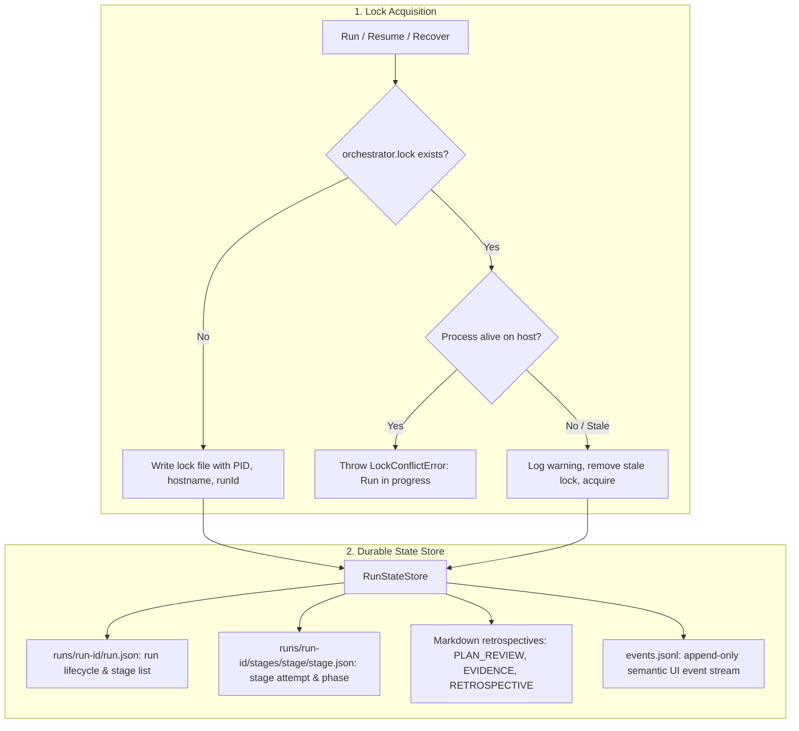

# State, Resume, and Recovery

All local runtime state lives under `.ai-orchestrator/`:

```text
.ai-orchestrator/
├── latest-run
├── orchestrator.lock
├── stage-input/
│   └── <stage-name>/
│       └── frozen/
├── stage-runtime/
│   └── <stage-name>/
│       ├── evidence.json
│       ├── evidence-corroborated.json
│       ├── approved-plan.md
│       └── executor-acp.jsonl
└── runs/
    └── <run-id>/
        ├── run.json
        ├── events.jsonl
        └── stages/
            └── <stage-name>/
                ├── stage.json
                ├── approved-plan.md
                ├── PLAN_REVIEW_HISTORY.md
                ├── EVIDENCE_CORROBORATED.md
                ├── REVIEW_RECORD.md
                └── STAGE_RETROSPECTIVE.md
```

Selected stage inputs are frozen and hashed before execution. Human-readable retrospective files are stored alongside machine JSON state.

## State persistence and concurrency



## Stage phases

```mermaid
stateDiagram-v2
  [*] --> Plan: Stage start
  Plan --> Implementation: Approved plan (or consolidated fallback)
  Implementation --> Quality: Code edits completed
  Quality --> Implementation: Quality command failed
  Quality --> Review: Mechanical corroboration green (exit 0 + patch match); phase persisted as review
  Review --> Implementation: Reviewer verdict REWORK
  Review --> Commit: Reviewer verdict APPROVE
  Commit --> Completed: AI branch commit created
  Completed --> [*]: Advance to next stage
```



## Resume and recovery flow

```mermaid
flowchart TD
  subgraph ResumeFlow [ai-harness resume]
    ResumeReq[ai-harness resume --run id] --> LoadRun[Load RunStateStore]
    LoadRun --> ActiveStage[Identify current in-progress or failed stage]
    ActiveStage --> CheckPlan{Approved plan exists & spec SHA256 matches?}
    CheckPlan -->|Yes| SkipPlan[Reuse approved plan & bypass planning]
    CheckPlan -->|No| RestartPlan[Enter PLAN phase]
    SkipPlan --> CheckEvidence{Corroborated evidence exists & patchFingerprint matches?}
    CheckEvidence -->|Yes| SkipImpl[Bypass implementation & resume at REVIEW]
    CheckEvidence -->|No| RunImpl[Resume at IMPLEMENT / QUALITY]
    RestartPlan --> RunImpl
  end

  subgraph RecoveryFlow [ai-harness recover]
    RecoverReq[ai-harness recover --apply] --> Backup[Create timestamped backup directory]
    Backup --> CheckJournal{Observation journal intact?}
    CheckJournal -->|No / Empty| Reconstruct[Reconstruct tool calls & exits from executor-acp.jsonl]
    CheckJournal -->|Yes| Corroborate[Cross-check evidence.json against observations & diff]
    Reconstruct --> Corroborate
    Corroborate --> Eval{Evidence corroborated & exit 0?}
    Eval -->|Valid & Untampered| SetReview[Reset attempt to 1 & set phase to REVIEW]
    Eval -->|Uncorroborated / Stale| SetQuality[Reset attempt to 1 & set phase to QUALITY]
    SetReview --> ReadyResume[Ready for ai-harness resume]
    SetQuality --> ReadyResume
  end
```



### Resume rules

- **Plan Reuse**: Approved plans can be reused only when plan and spec hashes strictly match. If stage specifications change, planning restarts from attempt 1.
- **Evidence Reuse**: Corroborated evidence can be reused only when `patchFingerprint()` matches the repository working tree. If untracked files or code changes occurred, implementation or quality gates must rerun.
- **Review Phase**: When `stage.json` records `phase: 'review'` and corroborated evidence still matches, resume can skip implementation and quality and continue final reviewer evaluation.
- **Native Sessions**: Executor session identifiers and epochs are persisted so ACP adapters can resume harness-native conversations without losing context.

### Recovery rules

- **Dry-Run Default**: `ai-harness recover` without `--apply` displays an audit preview of planned state corrections without making filesystem or Git mutations.
- **Timestamped Backups**: Applying recovery creates an isolated backup in `runs/<run-id>/backups/<timestamp>/` before mutating state.
- **Observation Reconstruction**: If tool execution observations were dropped due to process interruption, the recovery engine reconstructs them deterministically from the raw ACP session stream.

## Run status after reviewer failures

When a run stops during review, the orchestrator classifies errors for resume:

| Run status            | Typical reviewer cause                                            |
| --------------------- | ----------------------------------------------------------------- |
| `external_dependency` | Usage limits, rate limits, quota / credits                        |
| `retryable_error`     | Subprocess crash, timeout, `turn_failed` without a usable verdict |
| `failed`              | Unclassified or specification-level failures                      |

Reviewer failover (when configured) may complete the review without changing run status. When failover is disabled or the error is not a configured trigger, check `review-attempt-*.json` under the stage run directory for `_orchestrator_meta` provenance.

## History cleanup

`ai-harness runs reset --force` removes runs, frozen stage input, and runtime evidence, but intentionally preserves local configuration and permissions.
