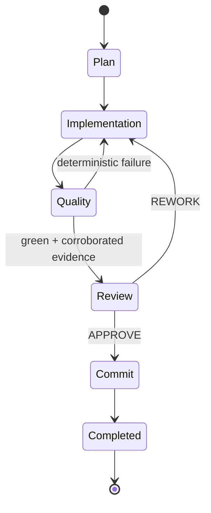

# State and Resume

All local runtime state lives under `.ai-orchestrator/`:

```text
.ai-orchestrator/
├── latest-run
├── orchestrator.lock
├── stage-input/
├── stage-runtime/
└── runs/<run-id>/
```

Selected stage inputs are frozen and hashed before execution. Human-readable retrospective files are stored alongside JSON state.

## Stage phases



Approved plans can be reused only when plan/spec hashes match. Evidence can be reused only when the patch fingerprint still matches.

Executor session identifiers are persisted when supported so adapters may resume harness-native conversations.

## History cleanup

`ai-harness runs reset --force` removes runs, frozen stage input and runtime evidence, but intentionally preserves local configuration and permissions.
