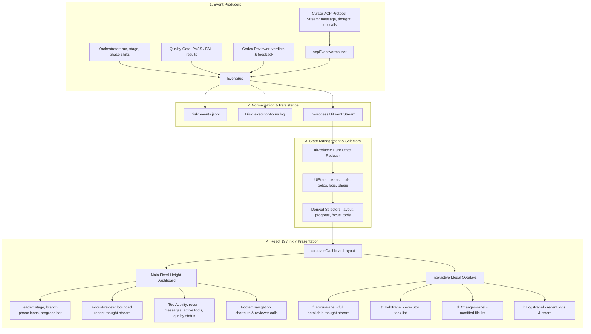

# Terminal UI

Interactive terminal presentations are built using React 19 and Ink 7. The dashboard dynamically adapts to terminal dimensions and enforces strict vertical height budgets to eliminate console jitter and screen bouncing.

The full executor focus and thought stream is persisted to disk in each stage's `executor-focus.log`; the primary dashboard renders a compact, stable preview with interactive full-screen inspection available on demand.

## UI architecture and semantic event flow

## Interactive Panels

The dashboard supports live hotkeys during execution:

| Key      | Mode / Action  | Description                                                                        |
| :------- | :------------- | :--------------------------------------------------------------------------------- |
| `f`      | Focus Stream   | Opens full scrollable agent thought and reasoning stream with follow/pause toggles |
| `t`      | Todos          | Displays the executor's task plan and completion statuses                          |
| `d`      | Changed Files  | Lists files modified during the current stage                                      |
| `l`      | Logs           | Displays recent runtime log messages, tool failures, and warnings                  |
| `q`      | Quiet Mode     | Toggles minimal one-line status bar to minimize terminal consumption               |
| `Esc`    | Main Dashboard | Exits any open modal overlay and returns to the primary multi-panel dashboard      |
| `Ctrl+C` | Abort          | Gracefully aborts current turn and persists state before exiting                   |

## Non-Interactive & CI Modes

The UI subsystem detects non-interactive terminals (e.g. CI runners or redirected stdout) and falls back gracefully:

- **`--ui line`**: Emits concise single-line phase and quality milestone summaries formatted for CI build output.
- **`--ui raw`**: Emits unformatted JSONL event lines for machine consumption or external ingestion.
- **Audit Logs**: Raw ACP and reviewer JSONL logs are always retained on disk under `.ai-orchestrator/runs/<run-id>/` for retrospective analysis regardless of display mode.
